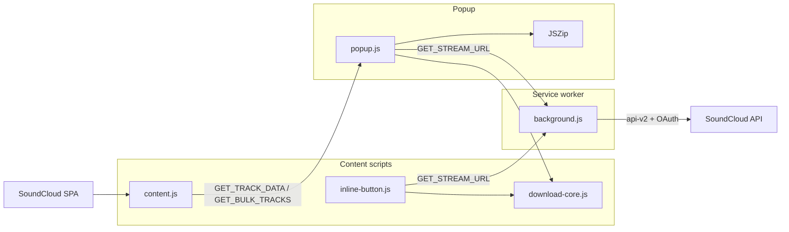
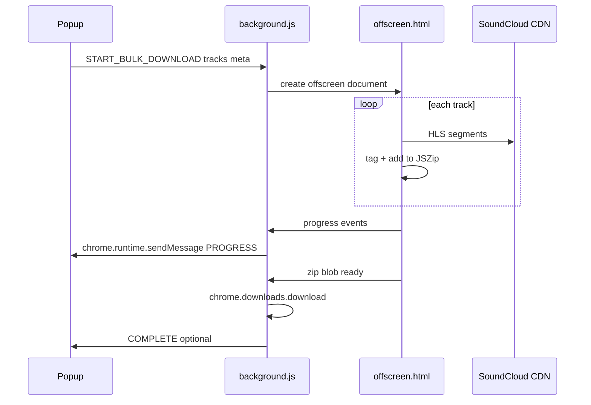
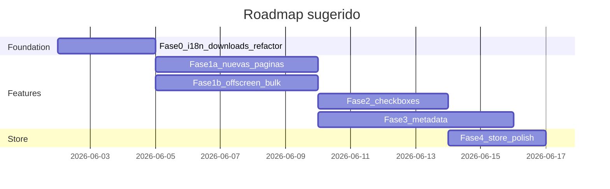

# Roadmap: SoundCloud Downloader — Features y mejoras

## Estado actual (resumen técnico)




| Capa                                                                | Rol                                                                                                                                 |
| ------------------------------------------------------------------- | ----------------------------------------------------------------------------------------------------------------------------------- |
| `[scripts/content.js](scripts/content.js)`                          | Detecta página (track / playlist `/sets/` / likes), extrae `__sc_hydration`, cachea `client_id`, expone `bulkContext`, SPA observer |
| `[scripts/background.js](scripts/background.js)`                    | Resuelve stream URL (public + OAuth fallback)                                                                                       |
| `[scripts/download-core.js](scripts/download-core.js)`              | HLS segment fetch (concurrencia 4), blob assembly, filename `Artist - Title.ext`                                                    |
| `[scripts/popup.js](scripts/popup.js)` + `[popup.html](popup.html)` | UI unificada; bulk = ZIP secuencial en memoria del popup                                                                            |
| `[scripts/inline-button.js](scripts/inline-button.js)`              | Botón solo en **páginas de track**                                                                                                  |


**Limitaciones actuales relevantes a tus prioridades:**

- Bulk download vive en el popup → cerrar popup = descarga interrumpida
- ZIP acumula todos los blobs en RAM antes de `generateAsync`
- Playlists/likes: presets numéricos, sin selección por track
- Metadatos: solo filename; `description`/`created_at` se extraen en `buildTrackDataFromApiTrack` pero no se usan
- Errores mezclados ES/EN en `[background.js](scripts/background.js)` (ej. líneas 85, 195, 203)
- Páginas soportadas: track, `/sets/`, `/likes` — no perfil `/tracks`, `/albums`, `/reposts`

---

## Tus prioridades (confirmadas)


| Área           | Decisión                                                            |
| -------------- | ------------------------------------------------------------------- |
| Enfoque        | Más fuentes + metadatos                                             |
| Páginas nuevas | Perfil tracks, álbums, reposts                                      |
| Selección      | Lista con checkboxes en popup                                       |
| Metadatos      | Tags completos + carátula + fecha/descripción                       |
| Calidad        | Auto (sin selector manual)                                          |
| Bulk formato   | ZIP (mantener)                                                      |
| Audiencia      | Chrome Web Store                                                    |
| Dolores        | RAM, popup se cierra, sin inline en colecciones, i18n inconsistente |


---

## Fases propuestas

### Fase 0 — Fundación (store-ready + dolores rápidos)

**Objetivo:** Base estable antes de features grandes.

1. **Unificar idioma** — Inglés en UI/errores (estándar para store) eliminar strings hardcodeados en español en `[background.js](scripts/background.js)`.
2. **Permiso `downloads`** en `[manifest.json](manifest.json)` — usar `chrome.downloads.download()` en lugar de `<a download>` para archivos sueltos y ZIP; mejor integración con carpeta del usuario y menos dependencia del DOM del popup.
3. **Refactor mínimo de orquestación** — extraer lógica de bulk de `[popup.js](scripts/popup.js)` a un módulo compartido (`scripts/download-orchestrator.js`) importable desde popup **y** background. Preparación para Fase 1b.

**Entregables:** mensajes consistentes, descargas vía API de Chrome, código bulk desacoplado del DOM.

---

### Fase 1a — Nuevas fuentes de contenido

**Objetivo:** Soportar las 3 páginas nuevas con el mismo flujo popup (metadata preview + bulk ZIP).

Extender detección de rutas en `[content.js](scripts/content.js)`:


| Página      | Path pattern                        | API SoundCloud (típico)                                                                |
| ----------- | ----------------------------------- | -------------------------------------------------------------------------------------- |
| User tracks | `/{user}/tracks` o perfil principal | `GET /users/{id}/tracks` (paginado)                                                    |
| User albums | `/{user}/albums`                    | `GET /users/{id}/albums` → cada álbum como sub-colección, o entrar al álbum (`/sets/`) |
| Reposts     | `/{user}/reposts`                   | `GET /users/{id}/track_reposts` o equivalente en hydration                             |


**Implementación:**

- Nuevas funciones `isSoundCloudUserTracksPage()`, `isSoundCloudUserAlbumsPage()`, `isSoundCloudUserRepostsPage()` — reutilizar patrón de `[extractLikesData](scripts/content.js)` / `[fetchLikesTracks](scripts/content.js)`.
- Ampliar `bulkContext.kind`: `"user_tracks" | "user_albums" | "reposts"` con paginación (`linked_partitioning`, `next_href`).
- Para **álbums**: decidir UX — (A) listar álbumes como colecciones separadas en popup, o (B) al abrir un álbum individual, reutilizar flujo playlist existente. Recomendación: **B para álbum individual** + en `/albums` mostrar grid/lista de álbums con botón "Download album" que navega mentalmente al flujo `/sets/`.
- Actualizar mensajes de error en popup (`not_track` → "supported pages" más amplio).
- README con nuevas páginas soportadas.

**Riesgo store:** scraping de `client_id` desde bundles — documentar en privacy policy; no almacenar credenciales.

---

### Fase 1b — Descarga que sobrevive al popup (sin cambiar ZIP)

**Objetivo:** Resolver "popup se cierra" manteniendo ZIP.

Aunque preferís ZIP-only, el popup **no puede** ser el proceso dueño de descargas largas en MV3.

**Arquitectura propuesta:**




- `**offscreen` document** (Chrome MV3): mantiene `fetch`, JSZip, y tagging activos mientras el service worker puede dormir menos críticamente.
- Popup solo inicia/monitorea; badge o notificación al terminar si popup cerrado.
- Progreso: `chrome.storage.session` o mensajes + badge `"3/50"`.

**Mitigación RAM (dentro de ZIP):**

- No guardar blobs duplicados: añadir al ZIP y liberar referencia al track anterior
- Opcional: límite configurable en settings ("max tracks per ZIP" para store safety)
- Warning existente (200+) + nuevo hint sobre memoria

**Permisos nuevos:** `"offscreen"`, `"downloads"`, posiblemente `"notifications"` (opcional, para bulk terminado).

---

### Fase 2 — Selección con checkboxes

**Objetivo:** Elegir tracks específicos en playlist/likes/perfil.

**UI en `[popup.html](popup.html)`:**

- Modo colección: expandir altura del popup (~500px max) con lista scrollable
- Cada fila: checkbox + título + duración + artista (si difiere)
- Toolbar: "Select all" / "Select none" / contador `"12 selected"`
- Presets actuales (`downloadLimit`) → **reemplazar o complementar**: preset pre-marca N primeros; checkboxes refinan selección
- Botón download deshabilitado si 0 seleccionados

**Datos:**

- Preview sigue limitado a `PREVIEW_LIMIT` (50) en content — para listas >50, al confirmar download llamar `GET_BULK_TRACKS` con IDs seleccionados o fetch paginado por índices
- Nuevo mensaje `GET_BULK_TRACKS_BY_IDS` o extender `GET_BULK_TRACKS` con `trackIds[]`

**Inline en colecciones (tu dolor):**

- Botón inline en header de playlist/likes/perfil: "Download" abre popup **o** mini-dropdown con preset — recomendación store-friendly: **icono que abre popup** (evita duplicar toda la UI inline)

---

### Fase 3 — Metadatos completos (ID3 / MP4 tags)

**Objetivo:** Título, artista, álbum, fecha, descripción, carátula embebida.

**Complejidad:** la extensión prioriza **AAC HLS → `.m4a`**. ID3 clásico es MP3; para M4A hace falta escribir átomos MP4 (`©nam`, `©ART`, `covr`, etc.).

**Enfoque recomendado:**

- Nueva dependencia vendor (similar a JSZip): `**mp4box.js`** o `**music-metadata` + writer** para MP4; `**browser-id3-writer`** solo cuando `streamProtocol === "progressive"` (MP3)
- Pipeline en `[download-core.js](scripts/download-core.js)`:

```
buildTrackBlob() → embedMetadata(blob, trackData) → return tagged blob
```

- Campos desde `trackData` existente + extras de API si hace falta:
  - `title`, `artist`, `album` (nombre playlist/álbum en bulk)
  - `created_at`, `description` (truncar descripción HTML)
  - `artwork_url` → fetch JPEG → embed `covr` / APIC
- En ZIP bulk: tags por track antes de `zip.file()`

**Store note:** aumenta tamaño del paquete y tiempo de CPU — mostrar en progress `"Tagging..."`.

**Fallback:** si tagging falla, entregar archivo sin tags (no bloquear download).

---

### Fase 4 — Pulido Chrome Web Store

Checklist orientado a tu audiencia `public_store`:


| Item                  | Acción                                                        |
| --------------------- | ------------------------------------------------------------- |
| Privacy policy        | Qué datos toca (cookies OAuth, no servidor propio)            |
| Screenshots           | Track, playlist con checkboxes, perfil tracks                 |
| Store listing         | Actualizar descripción con nuevas páginas + tags              |
| Iconos                | Verificar `icon48/128` referenciados en manifest              |
| Review compliance     | Disclaimer ToS (ya en README), no bypass de paywall Go+       |
| Options page (ligera) | Idioma, notificaciones on/off, confirmación bulk default      |
| Error reporting       | Códigos `#11`, `#22`, `#33` → mensajes humanos + log opcional |


---

## Orden de implementación recomendado




**Paralelizable:** Fase 1a (content/API) puede avanzar en paralelo con Fase 1b (infra offscreen) tras Fase 0.

---

## Decisiones técnicas clave

1. **Álbums list vs álbum individual:** en `/username/albums`, ¿querés descargar **todos los álbums del usuario en un mega-ZIP** o solo entrar álbum por álbum? *(Recomendación: álbum por álbum — alineado con playlists.)*
2. **Preview 50 tracks:** con checkboxes, ¿fetch lazy al scroll para listas de 500+ likes? *(Recomendación: sí, paginar UI.)*
3. **Notificaciones desktop** cuando bulk termina con popup cerrado — ¿las querés? *(Útil para store UX; permiso opcional.)*

---

## Archivos principales a tocar


| Archivo                                                             | Cambios                                                               |
| ------------------------------------------------------------------- | --------------------------------------------------------------------- |
| `[manifest.json](manifest.json)`                                    | `downloads`, `offscreen`, optional `notifications`, options_page      |
| `[scripts/content.js](scripts/content.js)`                          | Detección rutas, extractors user tracks/albums/reposts, bulk messages |
| `[scripts/background.js](scripts/background.js)`                    | Orquestación bulk, offscreen lifecycle, chrome.downloads              |
| `[scripts/download-core.js](scripts/download-core.js)`              | `embedMetadata()`, posible split mp3/m4a                              |
| `[scripts/popup.js](scripts/popup.js)` + `[popup.html](popup.html)` | Track list UI, selection state, progress from background              |
| **Nuevo** `scripts/download-orchestrator.js`                        | Bulk loop compartido                                                  |
| **Nuevo** `offscreen.html` + `scripts/offscreen.js`                 | ZIP + fetch largo                                                     |
| **Nuevo** `options.html` + `scripts/options.js`                     | Preferencias store                                                    |
| `[README.md](README.md)`                                            | Features, privacy, páginas soportadas                                 |


---

## Riesgos y mitigaciones


| Riesgo                          | Mitigación                                                   |
| ------------------------------- | ------------------------------------------------------------ |
| SoundCloud cambia hydration/API | Mantener retries actuales; tests manuales por tipo de página |
| MV3 service worker sleep        | Offscreen document + port keepalive durante bulk             |
| RAM en ZIP 200+ tracks          | Liberar blobs post-zip.file; warnings; documentar límites    |
| Tagging M4A complejo            | Librería probada; fallback sin tags                          |
| Store rejection (scraping)      | Privacy policy clara; mínimos permisos; no exfiltrar datos   |


