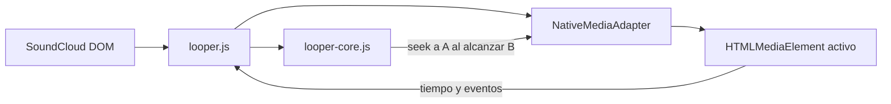

# SoundCloud Looper V1

## Resultado buscado

En una pagina individual de track aparece un unico boton de loop dentro de la fila de acciones del contenedor nuevo. Al activarlo, la waveform muestra dos marcadores arrastrables, A y B, y resalta el intervalo seleccionado. Mientras el track se reproduce, al alcanzar B el reproductor vuelve a A.

Este primer release usa el reproductor actual de SoundCloud y acepta un pequeno salto al reiniciar. El loop existe solo en memoria: desaparece al desactivarlo, recargar, navegar a otra pagina o cambiar el track que esta sonando.

## Decisiones cerradas

| Area | Decision para V1 |
| --- | --- |
| Superficie | Solo paginas individuales de track |
| Activacion | Un boton circular junto a las acciones existentes |
| Edicion | Dos marcadores A/B arrastrables sobre la waveform |
| Desactivar | El mismo boton cambia a una cruz; tambien responde a `Escape` |
| Rango inicial | Desde el tiempo actual hasta 10 segundos despues; cerca del final, los ultimos 10 segundos |
| Reproduccion | Control del reproductor nativo de SoundCloud |
| Precision | Loop simple; se admite un pequeno salto |
| Velocidad | Fuera de V1; se agregara dentro del looper |
| Pitch | Fuera de V1 |
| Persistencia | Ninguna, ni local ni por track |
| Navegacion | Cualquier cambio de pagina o track destruye el loop |
| Reproduccion automatica | Activar el loop no inicia un track pausado |
| Descargas | No se modifica su comportamiento |

## Experiencia de uso

1. El usuario abre una pagina de track y reproduce o posiciona el track.
2. Presiona el boton de loop ubicado antes de `Mas acciones`.
3. Aparecen A en el tiempo actual y B diez segundos despues. Si no se puede leer el tiempo actual, el rango es `0:00-0:10`.
4. La zona A-B queda coloreada con naranja semitransparente. Fuera del rango se aplica una sombra suave para que la seleccion sea evidente sin tapar la waveform.
5. El usuario arrastra cualquiera de los marcadores. Durante drag y hover se muestra el tiempo exacto; al soltar, si la reproduccion quedo fuera del nuevo rango, se posiciona en A.
6. Al llegar a B, el reproductor vuelve a A y conserva su estado de reproduccion.
7. Al presionar la cruz, `Escape`, cambiar de track o navegar, se retiran rango, marcadores y listeners.

No se agrega un panel permanente ni campos de texto en V1. El boton activo conserva el tamano de los botones vecinos y cambia su icono a una cruz, por lo que la fila gana un solo control.

### Interaccion de los marcadores

- Los marcadores usan Pointer Events y `setPointerCapture`, para que el drag no se pierda si el cursor sale de la waveform.
- El tiempo se obtiene con `clientX` y `getBoundingClientRect()`, sin depender de la cantidad de barras SVG.
- A nunca puede superar `B - 250 ms`; B nunca puede bajar de `A + 250 ms`.
- Los extremos se limitan a `0` y a la duracion real del track.
- `ArrowLeft` y `ArrowRight` mueven el marcador enfocado 100 ms; con `Shift`, 1 segundo.
- El drag detiene propagacion para no activar accidentalmente el seek propio de SoundCloud.
- Un seek nativo fuera del intervalo activo vuelve a A. Pausar, reanudar y cambiar volumen siguen siendo controles de SoundCloud.

## Ubicacion robusta en la interfaz nueva

El HTML capturado ofrece dos anclas semanticas estables:

- waveform: `[role="slider"][aria-label="Waveform"]`;
- menu final: boton con `aria-haspopup="true"` y etiqueta de mas acciones.

La implementacion debe partir de la waveform y buscar el menu dentro del mismo contenedor de track. No debe hacer una consulta global y tomar el primer boton coincidente, porque puede haber reproductores o tarjetas adicionales en la pagina.

Orden de resolucion:

1. Encontrar la waveform visible con `role=slider` y `aria-valuemax > 0`.
2. Subir hasta el contenedor de track que tambien contiene el titulo `h1` y la fila de acciones.
3. Dentro de ese contenedor, ubicar el boton de menu por `aria-haspopup=true` y etiquetas conocidas (`Mas acciones`, `More actions`).
4. Insertar el boton inmediatamente antes de ese menu y montar el overlay sobre el wrapper de la waveform.
5. Usar clases `mui-*` solo como ultimo fallback diagnosticado. Son generadas y no forman parte de la interfaz estable.

El boton copia la geometria y clases visuales del boton vecino, pero agrega identificadores propios (`data-scdl-looper`, clases `scdl-*`) para estilos y limpieza. El icono es SVG empaquetado o inline; no depende de una URL remota.

## Diseno de modulos



### `scripts/looper-core.js`

Modulo puro, sin DOM ni APIs de Chrome. Su interfaz contiene operaciones para:

- crear y normalizar `{ startMs, endMs, durationMs }`;
- convertir posicion horizontal a tiempo y tiempo a porcentaje;
- mover A o B respetando limites y separacion minima;
- decidir, dado `currentTime`, si corresponde volver a A.

Esta es la superficie principal de pruebas. Mantiene las reglas del loop fuera de listeners y estilos.

### `scripts/looper.js`

Es dueno del ciclo de vida completo: descubrir el contenedor, renderizar, arrastrar, conectar el reproductor, ejecutar el loop y desmontar. Expone una interfaz minima:

```js
SCLooper.ensureMounted()
SCLooper.reset(reason)
SCLooper.getState()
```

`reset()` debe ser idempotente: cancela `requestAnimationFrame`, desconecta observers propios, elimina listeners, restaura cualquier estilo de posicion agregado al wrapper y retira todo nodo `scdl-*`.

### `NativeMediaAdapter` interno

Oculta los detalles de SoundCloud y ofrece solo:

```js
getDurationMs()
getCurrentTimeMs()
seekToMs(timeMs)
isPaused()
getTrackIdentity()
subscribe(listener)
destroy()
```

Para V1, busca entre `audio, video` el elemento con reproduccion activa o con una fuente cargada y duracion compatible con `aria-valuemax`. El resto del looper no conoce selectores del player.

La seam del adaptador permite reemplazar el reproductor nativo por Web Audio en una version precisa sin reescribir marcadores ni estado.

## Fase 0: prueba tecnica obligatoria

El archivo `loopercontainer.txt` no contiene ningun `<audio>` o `<video>`, por lo que antes de construir la UI hay que validar el reproductor real con un track sonando:

1. Enumerar `document.querySelectorAll("audio, video")` y registrar para cada candidato `paused`, `duration`, `currentTime`, `currentSrc` y `readyState`.
2. Identificar el elemento cuyo tiempo avanza y cuya duracion coincide con `aria-valuemax` dentro de una tolerancia de 1 segundo.
3. Cambiar `currentTime` unos 250 ms y comprobar que audio, waveform y contador siguen sincronizados.
4. Repetir despues de avanzar al siguiente track y despues de una navegacion SPA.
5. Confirmar que el content script aislado puede realizar el seek. Los content scripts comparten el DOM aunque su entorno JavaScript este aislado.

Si el elemento no es accesible o SoundCloud revierte el seek, el fallback es un script empaquetado en `world: "MAIN"` que recibe comandos por `CustomEvent`. Ese bridge no usa APIs de extension ni acepta URLs o codigo; solo leer tiempo, buscar el media activo y hacer seek. No se agrega el bridge si la prueba directa funciona.

## Motor de loop simple

Mientras el loop esta activo:

- usar `requestAnimationFrame` para vigilar el tiempo en la pagina visible;
- escuchar tambien `playing`, `seeking`, `seeked`, `loadedmetadata`, `durationchange` y `emptied`;
- si `currentTime >= B`, ejecutar `seekToMs(A)` una sola vez y bloquear otra correccion hasta recibir `seeked` o detectar que el tiempo volvio al rango;
- si `currentTime < A` por un seek del usuario, volver a A;
- no llamar a `play()` si el media estaba pausado;
- ante buffer vacio o reemplazo del elemento, esperar brevemente a resolver el mismo track; si cambia la identidad, ejecutar `reset("track-changed")`.

No se promete una union sin cortes. El objetivo de V1 es que el punto de retorno sea consistente y que nunca se creen dos ciclos de vigilancia simultaneos.

## Ciclo de vida en la SPA

El estado incluye la identidad inicial del track, preferentemente permalink o ID visible del player; `currentSrc` se usa como senal secundaria porque puede cambiar al renovar un stream.

Se desmonta cuando ocurre cualquiera de estos eventos:

- cambia `location.href`;
- cambia la identidad del track del reproductor;
- desaparece o se reemplaza el contenedor asociado a la waveform;
- se recarga la pagina;
- el usuario presiona la cruz o `Escape`.

Un `MutationObserver` debounced vuelve a insertar el boton si React reconstruye el mismo contenedor mientras el loop esta inactivo. Si reconstruye la waveform durante un loop del mismo track, se vuelve a montar solo la vista usando el mismo estado A-B. Esto no cuenta como persistencia: todo sigue viviendo en la instancia de la pagina.

## Cambios previstos por archivo

| Archivo | Cambio |
| --- | --- |
| `manifest.json` | Cargar `looper-core.js` y `looper.js` despues de los scripts actuales; agregar bridge MAIN solo si la fase 0 lo exige |
| `scripts/looper-core.js` | Reglas puras de rango, conversion y decision de retorno |
| `scripts/looper.js` | Descubrimiento DOM, UI, drag, adaptador del reproductor y cleanup |
| `scripts/verify-looper.js` | Verificacion Node de limites, conversiones y transiciones |
| `README.md` | Describir el looper y aclarar alcance experimental de V1 |

`scripts/inline-button.js`, el popup y el circuito de descargas no forman parte del cambio salvo que una colision de estilos o montaje se demuestre durante la verificacion. Esto preserva el trabajo local reciente del boton de descarga del reproductor.

## Verificacion y criterios de aceptacion

### Automatizada

Siguiendo los verificadores existentes del repo, `node scripts/verify-looper.js` cubre:

- rango inicial al comienzo, mitad y ultimos segundos del track;
- clamp en ambos extremos;
- separacion minima de 250 ms;
- conversion pixel/tiempo con distintos anchos;
- decision de seek antes de A, dentro de A-B y al alcanzar B;
- duraciones invalidas o aun no disponibles;
- reset repetido sin errores.

### Manual en Chrome

- Track pausado: activar muestra A-B y no comienza a reproducir.
- Track sonando: activar conserva reproduccion y repite al alcanzar B.
- Arrastrar A y B no hace seek accidental por click-through.
- Cambiar uno de los marcadores durante reproduccion actualiza el siguiente ciclo.
- Pausar dentro del rango y reanudar conserva el loop.
- Usar la waveform nativa fuera del rango vuelve a A.
- Presionar cruz y `Escape` elimina el loop y deja el track en su tiempo actual.
- Cambiar de track con controles del player elimina el loop.
- Navegar a otro track, playlist, likes o perfil elimina el loop.
- Back/forward no recupera el rango anterior.
- React puede reconstruir el contenedor sin duplicar boton, overlay o listeners.
- Probar interfaz en espanol e ingles y anchos de ventana reducidos.
- Botones de descarga inline y del reproductor siguen funcionando.

El feature se considera listo cuando no hay duplicados, el cleanup se verifica en todos los cambios de contexto y diez ciclos consecutivos vuelven a A sin detener la reproduccion. La calidad de la union se registra como observacion, no como bloqueo de V1.

## Riesgos y respuestas

| Riesgo | Respuesta |
| --- | --- |
| SoundCloud cambia clases MUI | Selectores semanticos centralizados y fallback aislado |
| Hay varios media elements | Elegir por avance de tiempo, estado y coincidencia de duracion |
| React reemplaza waveform o media | Observer debounced, deteccion de identidad y montaje idempotente |
| `timeupdate` llega tarde | `requestAnimationFrame` en pagina visible mas eventos del media |
| El seek genera reentrada | Guard `isSeekingToStart` hasta confirmar retorno al rango |
| Track muy corto o duracion desconocida | Deshabilitar activacion hasta tener al menos 250 ms validos |
| Anuncios o contenido no-track | Resolver identidad; desmontar si no corresponde al track de pagina |

## Fuera de V1

- selector de velocidad;
- cambio de pitch;
- conservacion o liberacion de pitch al variar velocidad;
- loops guardados por track;
- sincronizacion entre dispositivos;
- inputs numericos de A/B;
- hotkeys globales para marcar puntos;
- cuantizacion por BPM o beats;
- crossfade, AudioBuffer, AudioWorklet o loop sample-accurate;
- monetizacion y validacion de licencia dentro del mismo PR.

## Siguiente plan: velocidad y audio preciso

La primera mejora debe agregar velocidad solo dentro del modo loop. El adaptador incorporara `getPlaybackRate()` y `setPlaybackRate(rate)`, con valores acotados y restauracion a `1x` al destruir el loop. La primera version puede usar `HTMLMediaElement.playbackRate` con pitch conservado por defecto. El selector no aparece cuando el looper esta cerrado.

Luego se puede evaluar un motor Web Audio para loops mas limpios y pitch independiente. Esa migracion reutiliza `looper-core.js` y la UI: reemplaza el adaptador y agrega procesamiento, buffering y crossfade.

## Producto y monetizacion

### Recomendacion

Mantener una sola extension. Las descargas actuales siguen gratis y el looper se ofrece como add-on premium dentro de ella. Una segunda extension duplicaria mantenimiento, dividiria reviews e instalaciones y podria acercarse a la politica de contenido repetitivo de Chrome Web Store si ambas comparten casi toda la experiencia.

El posicionamiento puede evolucionar de `SoundCloud Track Downloader` a algo como `SoundCloud Toolkit - Downloader & Looper`, manteniendo un proposito unico: herramientas para trabajar con tracks de SoundCloud.

### Precio

`USD 2.99` funciona como precio introductorio de compra unica para validar demanda con poca friccion. Conviene comunicarlo como `early price` y conservarlo para quienes compren. Cuando el add-on incluya velocidad, mejor precision y eventualmente pitch, el precio para compradores nuevos puede subir a `USD 4.99` o `USD 7.99` sin cambiar la licencia de los anteriores.

### Implementacion comercial posterior

No conviene bloquear V1 con pagos. Primero se valida que el loop sobreviva a la interfaz real de SoundCloud. Despues:

1. Elegir checkout externo y flujo de licencia de compra unica.
2. Mostrar el boton para todos; sin entitlement, el click abre una explicacion breve y el checkout.
3. Activar con una clave o enlace de licencia y guardar solo el entitlement necesario en `chrome.storage.local`.
4. Verificar la licencia contra un backend liviano y cachear una concesion firmada con periodo offline. Un boolean local solo es facil de modificar.
5. Declarar compras dentro de la app en la ficha de Chrome Web Store y actualizar privacidad si se transmite email, clave, IP u otro identificador.
6. Mantener todo el codigo ejecutable dentro del paquete MV3; el servidor devuelve datos de licencia, no scripts.

La compra y la licencia forman un modulo separado del looper. El looper consulta una sola interfaz `canUse("looper")`; no conoce proveedor, checkout ni credenciales.

## Orden de implementacion recomendado

1. Ejecutar la prueba de acceso y seek sobre SoundCloud real.
2. Construir y verificar `looper-core.js`.
3. Implementar `NativeMediaAdapter` y demostrar el retorno A-B sin UI final.
4. Montar boton, overlay y drag sobre el contenedor nuevo.
5. Completar cleanup de SPA, accesibilidad y respuestas a reconstruccion de React.
6. Ejecutar verificador Node y matriz manual.
7. Documentar y lanzar una beta funcional sin paywall.
8. Medir uso y fallos antes de implementar licencia y cobro.

