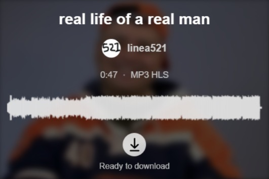
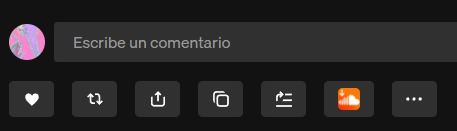

# 🎵 SoundCloud Downloader

> Download SoundCloud tracks, playlists, and likes ~ right from your browser. One extension, one click.

## 🆕 Update ~ 2026.06.01

This release is a **big one**. What started as a single-track downloader is now a fully polished bulk-download tool ~ with a ton of bug fixes and UX improvements along the way.

**Highlights:**
- **Inline download button** ~ download tracks directly from SoundCloud's action bar (Like/Repost/Share) without opening the popup
- **Player download button** ~ download the track currently playing from SoundCloud's persistent bottom player without opening the popup
- **Playlists, sets & albums** ~ download collections as numbered files in a folder
- **International filenames** ~ preserves Cyrillic, accented, CJK, and emoji titles while keeping paths safe on Windows, macOS, and Linux
- **Remembered download folder** ~ use the native folder picker once, then change the destination beside the quality and amount selectors whenever needed
- **Likes** ~ your own (`/you/likes`) or any user's public likes page
- **Background bulk downloads** ~ close the popup or switch tabs; downloads keep running
- **Low memory usage** ~ at most two tracks in memory at a time (no giant ZIP in RAM)
- **Configurable batch size** ~ choose how many tracks to grab: `10`, `25`, `50`, `100`, `150`, `200`, `300`, or **All**
- **No login required** for most public tracks (OAuth fallback when needed)
- **Modern AAC HLS streaming** support ~ SoundCloud's current format, handled automatically
- **SPA-friendly** ~ switch tracks, playlists, or pages without reloading SoundCloud
- **Polished UI** ~ loading spinner, clear error states, download progress, pause/cancel, badge, and notifications
- **Real Audio** ~ when an artist enables downloads on SoundCloud, the extension grabs the uploaded file (WAV/FLAC/MP3) instead of the streamed transcode

If you used an older version and ran into bugs ~ stale track data, blank screens, login-only downloads ~ this update was built to fix exactly that. 🎉

---

## ✨ Features

### Single tracks
- Track title, artwork, and artist info (with clickable profile link)
- Duration and stream format (e.g. `AAC HLS 160k`)
- Waveform visualization
- One-click download ~ works on public tracks without signing in
- **Inline download button** on the track page action bar (next to Like/Repost/Share) ~ same download flow, no popup needed
- **Player download button** in the persistent bottom player ~ downloads the track that is currently playing, even when the open page is a feed, playlist, or another track
- **Experimental A-B looper** on individual track pages ~ drag the A/B markers over the waveform and repeat the selected section without starting paused audio
- **Inline download button** on playlist/set and likes pages ~ starts a background bulk job for the full collection
- **User profile downloads** ~ open `soundcloud.com/{user}/tracks`, choose from every public upload, and download the selection as one background job

### Playlists, sets & albums
- Open any `soundcloud.com/{user}/sets/{name}` page
- See the collection title, artist, total track count, and waveform preview (first track)
- Pick how many tracks to download from the preset selector
- Download everything as numbered files in `Downloads/{Playlist Name}/`

### Likes
- **Your likes:** `soundcloud.com/you/likes` (requires being logged in)
- **Anyone's likes:** `soundcloud.com/{username}/likes`
- Same folder-based bulk download flow as playlists

### Bulk download controls
- Presets: **10 · 25 · 50 · 100 · 150 · 200 · 300 · All**
- Options adapt to the actual collection size (e.g. a 30-track playlist shows `25` and `All`)
- Warning prompt before large downloads (200+ tracks)
- **Pause / resume / cancel** while a bulk job is running
- **Extension badge** shows progress (e.g. `30/500`)
- **Desktop notification** when the job finishes (even if the popup was closed)

### Reliability & UX
- Deferred metadata loading ~ fast popup open, full resolution only when you hit download
- Loading overlay with retry on timeout
- Clear error screen when you're not on a supported page
- Download progress: `Track 3/50 ~ Downloading 12/48 parts...`
- SPA navigation detection ~ no more stale track data when browsing SoundCloud
- Bulk jobs run in a background offscreen worker ~ safe for playlists with hundreds of tracks on modest hardware

---

## 🚀 How It Works

### Download a single track
1. Go to any SoundCloud **track** page
2. Click the **player download icon** in the persistent bottom player, the **inline download button** in the action bar (next to Like/Repost/Share), **or** click the extension icon and use the popup download button
3. Wait for the track info to load (popup only)
4. Hit download ~ the file saves to your browser's default download folder

Use the compact **Folder** button beside the format selector to open the system folder picker. The chosen directory is remembered and used as the final destination; create any new folder directly in that picker. If no folder is selected, the browser's default Downloads directory is used.

### Loop part of a track

1. Open an individual track page and load or play the track
2. Press the loop button immediately before **More actions**
3. Drag A and B on the waveform; use the arrow keys for 100 ms adjustments or Shift + arrow for 1 second
4. Press the cross or `Escape` to remove the temporary loop

The loop uses SoundCloud's current player and lives only in memory. Navigating or changing tracks removes it. Speed, pitch, saved loops, and loop downloads are intentionally reserved for later versions.

### Download a playlist, likes, or user uploads
1. Go to a **playlist/set**, **likes**, or `soundcloud.com/{user}/tracks` page
2. Click the **inline download button** in the action bar, **or** click the extension icon and use the popup
3. Choose how many tracks to download from the dropdown next to the track count (popup only)
4. Hit the download button
5. Files appear directly in the chosen folder as they complete. Without a chosen folder, they appear in `Downloads/{Collection Name}/`
6. You may **close the popup or tab** ~ the download continues in the background

On user track pages, the in-page **Download tracks** button opens the selector with every upload selected by default.

The selected folder is the final destination; the extension does not add another playlist/profile subfolder beneath it.

---

## 🎨 User Interface

One popup, two modes ~ same look, same feel:

| Track page | Playlist / Likes page |
|---|---|
| Title · artist · duration · format | Title · artist · `{N} tracks · [preset]` |
| Waveform | Waveform (first track) |
| Inline button + popup download | Inline button (full list) or popup with preset selector |

Dark blurred artwork background, SoundCloud-orange accents, spinner states, and status text that actually tells you what's going on.

---

## 🛠️ Technical notes

- **Manifest V3** Chrome extension
- Streams resolved via SoundCloud's `api-v2` (public `client_id` + optional OAuth cookie)
- HLS segments fetched and assembled client-side; output as `.m4a` / `.mp3` depending on source
- Bulk downloads use `chrome.downloads` for the default Downloads location or the File System Access API for a user-selected folder, plus an offscreen document ~ at most two tracks at a time, minimal RAM
- Bulk jobs survive popup/tab close; per-track state ensures recovery after service worker restarts
- Job state stored in `chrome.storage.session` (cleared when Chrome exits)
- Pause stops new tracks; in-flight downloads still finish and save
- Large collections: pagination handled automatically; stream URLs refreshed per track if they expire
- The A-B looper keeps its timing rules in a DOM-free module so a future precise audio/download adapter can reuse the same range
- SoundCloud's detached `Audio` player is captured by a minimal MAIN-world bridge; the looper UI only exchanges player state and seek commands with it

---

## 🔧 Troubleshooting

**Extension doesn't recognize the track page**
- Make sure you're on a track URL like `soundcloud.com/artist/track-name` (not the home feed or search)
- If you navigated from likes or another page and the popup stays blank, wait a few seconds or click **Retry** — a full page refresh is rarely needed now

**Download fails or shows an error**
- **Ad blockers** can block requests to `*.sndcdn.com`. Disable your ad blocker for `soundcloud.com` and try again
- **Enable popups and redirects** for `soundcloud.com` in your browser settings (required for some download flows)
- Sign in to SoundCloud if the track is private or requires login

**Audio quality**
- SoundCloud does not offer a 320 kbps stream — the best transcode available is typically **AAC 160k**
- When the artist has enabled downloads, the extension automatically uses the **original uploaded file** (often WAV, FLAC, or high-quality MP3)
- Otherwise, files are saved from SoundCloud's streaming transcode (~50–80 MB/hour)

---

## 💡 Feedback

Something not working? A feature you'd love to see next?
- Open a Pull Request, send me an email, or drop a message ~ I'd love to hear from you.

---

## ⚠️ Disclaimer

Please respect artists' rights and SoundCloud's terms of service when using this extension. Download only content you have the right to save for personal use.

---

*Made with ❤️ for music lovers ~ and for myself, obviously.*
